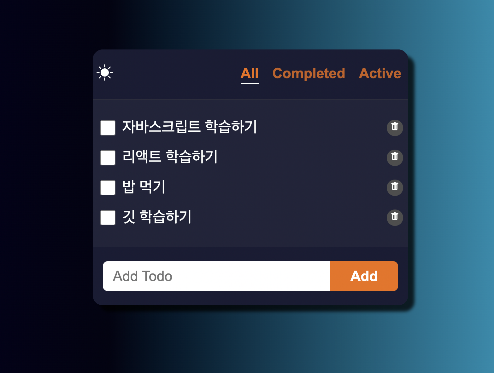

# todoList

# todoList의 기능
1. 사용자의 input을 받아 todo를 출력하고, 원하는 todo를 delete 할 수 있음.
2. checkbox를 통해 completed와 active한 todo만을 보여줄 수 있도록 함.
3. 다크모드,라이트모드 구현
4. 새로고침 하여도 기존의 todo와 다크모드의 상태를 받아옴.

# todoList를 만든계기와 느낀 점
리액트를 학습하면서, 간단한 결과물을 만들며 리액트에 좀 더 익숙해지고 활용해보기 위해 todoList를 만들어 보았습니다.
* todoList를 만들면서 배운점
1. useState를 사용하여 배열이라는 상태를 업데이트하고 수정할 수 있음.
2. 필터링하여 보여주고자 하는 item들만 보여줄 수 있음.
3. useEffect와 localstorage를 통해 웹에 데이터를 저장하고, 불러올 수 있음.
4. useContext를 사용하여 다크모드의 상태를 전달하고자 하는 컴포넌트에만 전달 할 수 있음.
5. css 라이브러리인 post-css 를 사용하여 post-css 사용법을 학습함.
# todoList를 만들면서 어렵거나 헷갈렸던 점
* 좋은 변수,함수,컴포넌트의 네이밍은 무엇인가
* 좋은 컴포넌트의 분리란 무엇인가
* 어떤 hook을 사용하여 상태관리를 할것인지(최적화가 꼭 필요한지 여부)
* 상태를 어느 컴포넌트에서 관리를 하는것이 좋은지
# todoList를 만들면서 총평
* 리액트뿐만 아니라 자바스크립트 웹 api, html 시맨틱 태그, css 라이브러리 등등 기존에 알고있다고 생각했던 부분들에 대해서  
조금 더 알아가고 익숙해지는 계기가 되었음.
* 다음프로젝트는 서버와 통신하여 데이터를 주고받을 수 있는 프로젝트를 만들어 보고 싶다.

